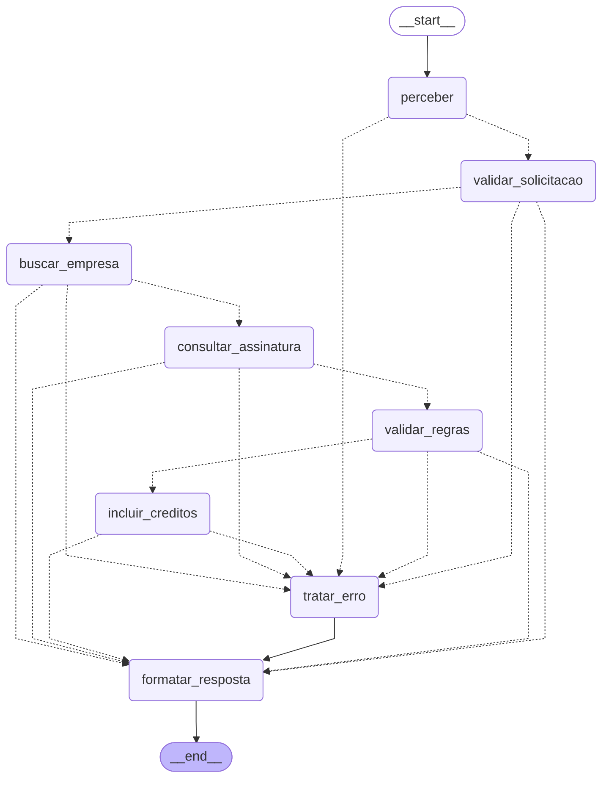

# Fluxo do agente SaaS

```mermaid
---
config:
  flowchart:
    curve: linear
---
graph TD;
	__start__([<p>__start__</p>]):::first
	perceber(perceber)
	validar_solicitacao(validar_solicitacao)
	buscar_empresa(buscar_empresa)
	consultar_assinatura(consultar_assinatura)
	validar_regras(validar_regras)
	incluir_creditos(incluir_creditos)
	tratar_erro(tratar_erro)
	formatar_resposta(formatar_resposta)
	__end__([<p>__end__</p>]):::last
	__start__ --> perceber;
	buscar_empresa -.-> consultar_assinatura;
	buscar_empresa -.-> formatar_resposta;
	buscar_empresa -.-> tratar_erro;
	consultar_assinatura -.-> formatar_resposta;
	consultar_assinatura -.-> tratar_erro;
	consultar_assinatura -.-> validar_regras;
	incluir_creditos -.-> formatar_resposta;
	incluir_creditos -.-> tratar_erro;
	perceber -.-> tratar_erro;
	perceber -.-> validar_solicitacao;
	tratar_erro --> formatar_resposta;
	validar_regras -.-> formatar_resposta;
	validar_regras -.-> incluir_creditos;
	validar_regras -.-> tratar_erro;
	validar_solicitacao -.-> buscar_empresa;
	validar_solicitacao -.-> formatar_resposta;
	validar_solicitacao -.-> tratar_erro;
	formatar_resposta --> __end__;
	classDef default fill:#f2f0ff,line-height:1.2
	classDef first fill-opacity:0
	classDef last fill:#bfb6fc

```
